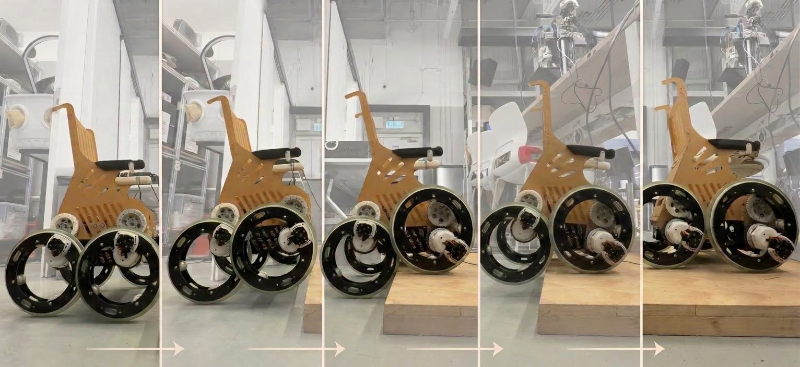
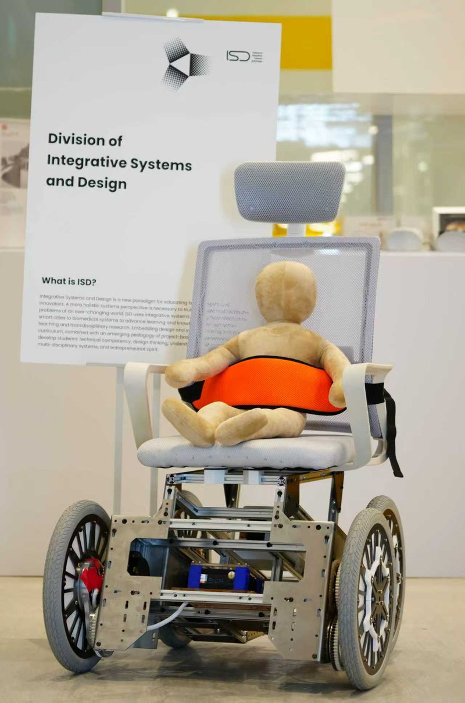
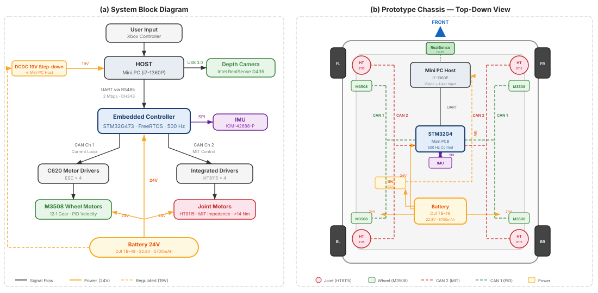
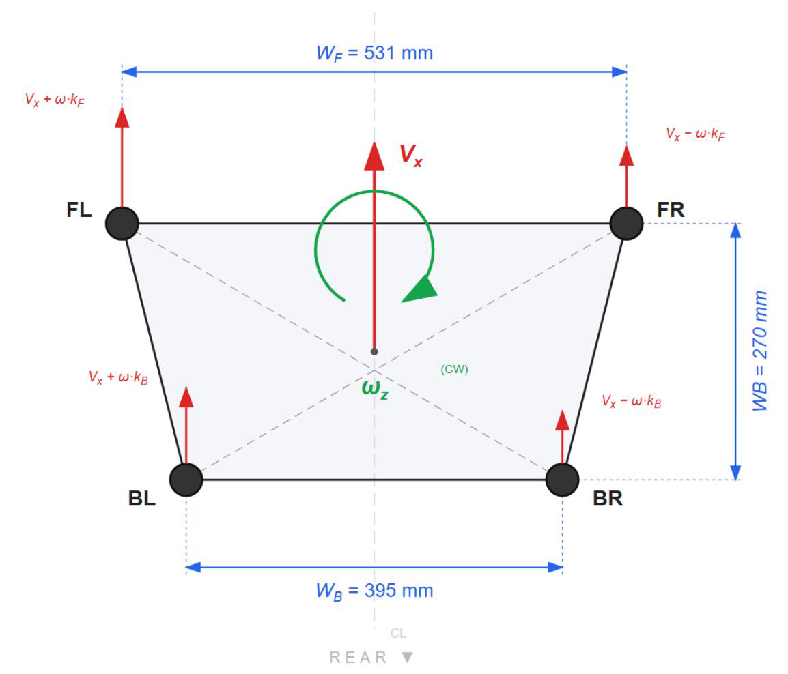
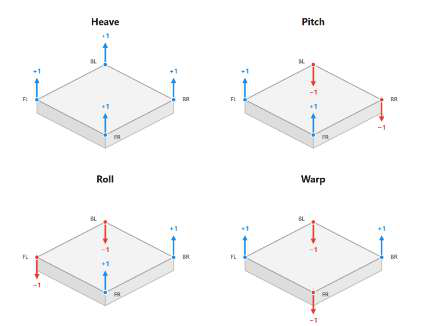
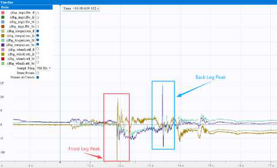
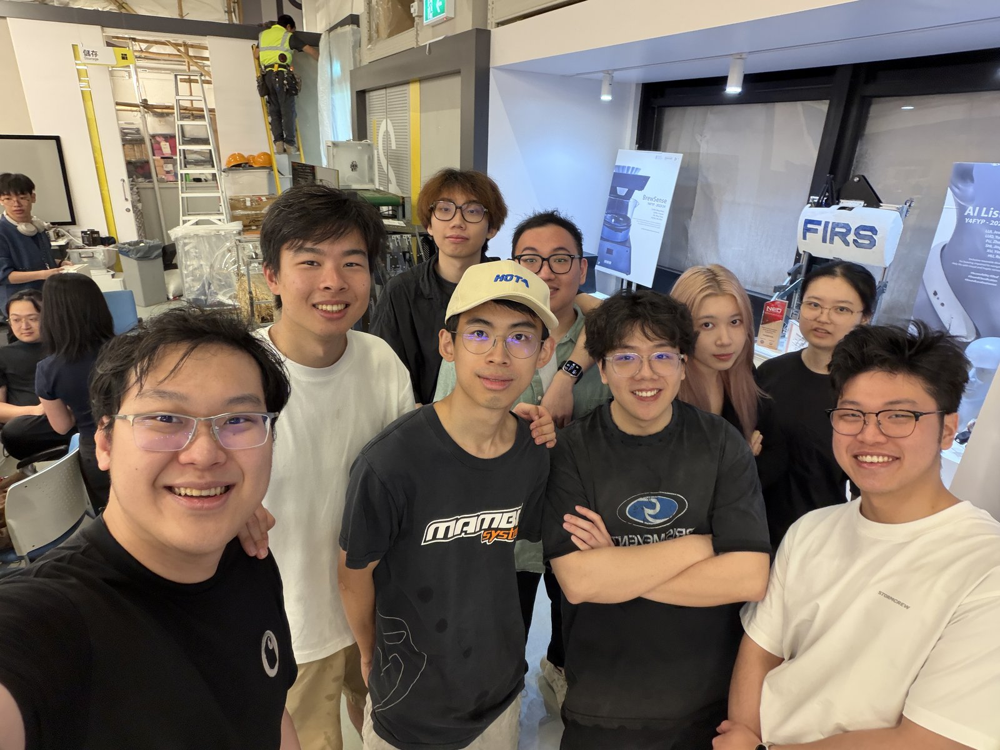

# Circle_Leg_V1 — REACHABLE (QuadCirc) Half-Size Prototype Firmware

<p align="center">
  
  
  
  
  
</p>

<p align="center">
  <a href="#overview">English</a> | <a href="#项目概述">中文</a>
</p>

<p align="center">
  
</p>

Embedded control firmware for the **half-size proof-of-concept** of REACHABLE (QuadCirc). This is
the prototype where the CircLeg eccentric wheel-leg idea, the variable-impedance suspension and the
torque-residual step climbing were first built and validated. HKUST Final Year Design Project
**SL05a-25**.

> The final full-size vehicle uses the same control architecture, ported to new motors and geometry.
> Its firmware is [Circle_Leg_V2.0](https://github.com/QuadCirc-Reachable/Circle_Leg_V2.0).

---

## Overview

The half-size build tested the core claim of the project: **the wheel is the leg**. Each corner has
one wheel motor and one leg motor. The leg motor rotates the wheel hub about an eccentric offset to
raise or lower that corner, so the chassis can level itself and roll over a step edge.

- **Hardware**: STM32G473 + FreeRTOS at 500 Hz, 4× DJI M3508 wheel motors, 4× HT8115 leg motors in
  MIT impedance mode (GM6020 legs still supported as a build option), ICM-42688-P IMU, UART link to a
  host PC.
- **Control**: skid-steer IK for the trapezoidal chassis, wheel-leg decoupling, pitch/roll leveling,
  variable-impedance suspension, warp compensation, and per-leg kinematic step climbing with
  torque-residual contact detection.
- **Lessons carried into V2**: the first iteration used GM6020 leg motors, which could not lift the
  chassis under load. Switching to the HT8115 (about 10× the torque, with native MIT impedance
  control) made the compliant suspension approach possible.

---

## 项目概述

<details>
<summary>点击展开中文说明</summary>

本仓库是 REACHABLE（QuadCirc）**半尺寸概念验证原型** 的嵌入式控制固件。CircLeg 偏心轮腿、
变阻抗主动悬挂和力矩残差台阶攀爬都是在这台原型上首次实现并验证的。香港科技大学毕业设计项目 **SL05a-25**。

- **硬件**：STM32G473 + FreeRTOS（500 Hz），4 个 DJI M3508 轮电机，4 个 HT8115 腿电机（MIT 阻抗模式，
  编译选项仍支持 GM6020），ICM-42688-P IMU，与上位机串口通信。
- **控制**：梯形底盘差速逆运动学、轮腿解耦、Pitch/Roll 调平、变阻抗悬挂、Warp 补偿，以及基于力矩残差
  检测的逐腿运动学攀爬。
- **经验**：最初使用的 GM6020 腿电机在负载下无法抬起底盘；改用 HT8115（扭矩约 10 倍、原生 MIT 阻抗控制）
  后，柔顺悬挂方案才得以实现。

最终全尺寸整车使用同一套控制架构，固件见 [Circle_Leg_V2.0](https://github.com/QuadCirc-Reachable/Circle_Leg_V2.0)。

</details>

---

## Demo | 演示

<p align="center">
  <a href="https://youtu.be/onJCvx1d8Sw">
    
  </a>
</p>

<p align="center">
  ▶ <a href="https://youtu.be/onJCvx1d8Sw">Watch the REACHABLE pitch video on YouTube</a> · <a href="https://youtu.be/onJCvx1d8Sw">在 YouTube 观看项目视频</a>
</p>

---

## Key Results | 主要结果

Half-size validation, as reported in the team's final project report:

| Item | Result |
|------|--------|
| Driving speed | ≈ 1.34 m/s, controllable driving and steering |
| CircLeg actuation | Smooth full-range leg motion in MIT impedance mode |
| Step climbing | Small curbs up to ≈ 6.5 cm, limited by the 65 mm eccentric offset |
| Test setup | 75 cm dummy, procedures referencing ISO 7176 stability and obstacle-climbing tests |

All control algorithms take *R*, *r* and the step height as parameters, so the same code scaled
directly to the full-size geometry, where the larger offset covers the 5–18 cm target.

<p align="center">
  <a href="https://github.com/QuadCirc-Reachable/Circle_Leg_V2.0">
    
  </a>
</p>
<p align="center"><sub>The full-size successor running the same control stack · 采用同一控制架构的全尺寸整车 →
<a href="https://github.com/QuadCirc-Reachable/Circle_Leg_V2.0">Circle_Leg_V2.0</a></sub></p>

---

## System Architecture | 系统架构

<p align="center">
  
</p>

```
Host PC ──UART 2 Mbit/s──► PC_Comm ──► Chassis_Task (500 Hz)
                                          │
                                   Chassis state machine
                  CALIBRATION · IDLE · ENERGY_SAVING · COMFORT · CLIMBING · FREE_CONTROL · DEBUG
                                          │
          Impedance_Controller · Ground_Contact (warp) · Climbing_Dynamics · Body PID · IK
                                          │
                               Wheel_Leg ×4 (FL · FR · BL · BR)
                          ┌───────────────┴────────────────┐
                    CAN: 4× M3508 (C620)             CAN: 4× HT8115 (MIT)
                    wheel velocity PID               leg {θ, ω, Kp, Kd, τ_ff}
```

Control-chain diagrams (HTML; download and open locally in a browser):
[COMFORT](docs/control-chains/Comfort_Mode_Chain.html) ·
[CLIMBING](docs/control-chains/Climbing_Mode_Chain.html).

---

## Control Design | 控制设计

### Eccentric kinematics | 偏心运动学

With *R* = 160 mm and *r* = 65 mm, V1 uses the convention

$$H(\theta) = R + r\cos\theta, \qquad \theta = \arccos\frac{H - R}{r}, \qquad \left|\frac{\partial H}{\partial\theta}\right| = r\,|\sin\theta|$$

The working range is clamped to [10°, 170°] to stay away from the singularities at 0° and 180°.
Bending direction (legs outward or inward) is selectable per corner.

### Locomotion | 行驶

<p align="center">
  
</p>

The chassis is trapezoidal (*W<sub>F</sub>* = 531 mm, *W<sub>B</sub>* = 395 mm, wheelbase 270 mm).
Per-axle gains $k_F = W_F/W_\text{avg}$ and $k_B = W_B/W_\text{avg}$ stop it drifting sideways in
straight-line driving. A decoupling feed-forward, $n_\text{comp} = n_\text{leg}\,(1 + \tfrac{r}{R}\cos\theta)$,
cancels the wheel motion caused by hub rotation, so the chair doesn't lurch when the ride height
changes.

### COMFORT — suspension, leveling, warp | 主动悬挂、调平与 Warp

- **Variable impedance**: $K_p = r^2\sin^2\theta\,k_v$ and $K_d = r^2\sin^2\theta\,c_v$ map a virtual
  spring-damper at the contact point to the HT8115 MIT gains. Joint stiffness vanishes naturally at
  the singularities.
- **Gravity feed-forward** comes from an online mass estimate (low-pass filtered leg currents).
- **Leveling**: roll / pitch PID loops produce per-leg height offsets.
- **Warp**: the diagonal current imbalance
  $e_\text{warp} = \tfrac12(I_{FL}+I_{BR}) - \tfrac12(I_{FR}+I_{BL})$ modulates stiffness in COMFORT
  and drives a PI height correction in CLIMBING.

<p align="center">
  
</p>

### CLIMBING — torque-residual detection and kinematic climb | 攀爬

<p align="center">
  
</p>

Each leg runs **IDLE → PREP → DETECT → CLIMBING → COMPLETE**. The front pair climbs first, and the
back pair starts automatically once both fronts complete.

- **Detection**: residual $\tau_\text{res} = \tau_\text{fb} - \tau_\text{gravity}$ against an adaptive
  low-pass baseline. A deviation above 3.0 N·m held for 20 ms confirms step contact. Because it
  responds to change, payload and tilt drift don't cause false triggers.
- **Trajectory**: the constraint $\cos\theta = (R + r - h - R\sin\beta)/r$ for a wheel rolling over
  a step edge of height *h* gives the leg angle as the wheel pivots (β).
- **Pitch bias**: the chassis leans back while the fronts climb and forward while the backs climb,
  which moves weight onto the supporting wheels.

Full derivations: [docs/TECHNICAL_REPORT.md](docs/TECHNICAL_REPORT.md)
([中文版](docs/TECHNICAL_REPORT_zh.md)).

---

## Repository Structure | 目录结构

```
Circle_Leg_V1/
├── Applications/                   # Application layer | 应用层
│   ├── Chassis.hpp/.cpp            # Mode state machine, leveling, IK, climbing orchestration
│   ├── Chassis_Task.hpp/.cpp       # FreeRTOS 500 Hz control task
│   ├── Wheel_Leg.hpp/.cpp          # One corner: M3508 velocity PID + HT8115 MIT leg pipeline
│   ├── Impedance_Controller.*      # Variable-impedance suspension
│   ├── Ground_Contact.*            # Warp PI compensator
│   ├── Climbing_Dynamics.*         # Per-leg climbing FSM, torque-residual detection
│   ├── Controller.*                # Joystick → (Vx, Wz)
│   ├── PC_Comm.*                   # Host UART link, link watchdog
│   ├── Robot_Config.* / Robot_Params.hpp   # Motors, IDs, geometry, gains
│   └── Comm_Msg.hpp, Cust_Types.hpp, Helper.hpp
├── Core/                           # CubeMX HAL init + UserTask.cpp
├── Drivers/, Middlewares/          # STM32G4 HAL, CMSIS, CMSIS-DSP (vendor)
├── RM2025-Core/                    # Submodule → private RM2025-Core (tag circle-leg-v1)
├── docs/
│   ├── TECHNICAL_REPORT.md / TECHNICAL_REPORT_zh.md
│   ├── CODE_STRUCTURE.txt
│   ├── control-chains/             # COMFORT / CLIMBING control-chain diagrams (HTML)
│   └── figures/
├── Makefile, Core.mk, RM2024-Template-G473.ioc, stm32g473vetx_flash.ld, startup_stm32g473xx.s
└── LICENSE
```

The `dev` branch contains an unmerged experiment by Jaccob (a `WheelModule_t` motor/PID wrapper).

---

## Getting Started | 快速开始

Requires `arm-none-eabi-gcc` (tested with GCC 12.2), GNU Make, a SWD probe, and read access to the
private [QuadCirc-Reachable/RM2025-Core](https://github.com/QuadCirc-Reachable/RM2025-Core)
(the HKUST ENTERPRIZE RoboMaster team's internal library, linked as a submodule and not included here).

```bash
git clone --recurse-submodules https://github.com/QuadCirc-Reachable/Circle_Leg_V1.0.git
cd Circle_Leg_V1.0
make -j8          # → build/RM2024-Template-G473.elf / .hex / .bin
```

Flash the ELF over SWD (Ozone / J-Flash / STM32CubeProgrammer). Every commit pins its exact
RM2025-Core snapshot, so old commits still rebuild after `git submodule update`.

---

## Operator Controls | 操作说明

| Input | Function |
|-------|----------|
| Left stick / right stick | Forward-backward speed / turn rate |
| `ML` / `MR` | Previous / next mode (IDLE → ENERGY_SAVING → COMFORT → CLIMBING → FREE_CONTROL → DEBUG) |
| `ML` + `MR` | CALIBRATION: re-enter HT8115 motor mode and zero the legs |
| `A` / `X` / `Y` / `B` | Height presets 45° / 90° / 145° / 165° (legs outward) |
| `LB` / `RB` | Height presets 90° / 135° with inward bending |
| Triggers (FREE_CONTROL) | Direct leg-angle command |

Host: [Circle_Leg_Host_V1.0](https://github.com/QuadCirc-Reachable/Circle_Leg_Host_V1.0). V1 uses
the **13-byte** `PC_Msg`, which has no D-pad byte. That matches the host up to commit `7adb072`;
later host commits send the 14-byte V2 message.

---

## Documentation | 文档

| Document | Content |
|----------|---------|
| [docs/TECHNICAL_REPORT.md](docs/TECHNICAL_REPORT.md) | Kinematics, state machine, leveling, IK, decoupling, VMC, impedance, warp, climbing, protocol, RTOS |
| [docs/TECHNICAL_REPORT_zh.md](docs/TECHNICAL_REPORT_zh.md) | Chinese version (中文版) |
| [docs/CODE_STRUCTURE.txt](docs/CODE_STRUCTURE.txt) | Class hierarchy, per-mode control flow, parameters |
| [docs/control-chains/](docs/control-chains/) | COMFORT / CLIMBING control-chain diagrams |

---

## Team | 团队

<p align="center">
  
</p>

REACHABLE (QuadCirc), HKUST FYP SL05a-25. Firmware by **LIU Hualin** (embedded control lead).
Team: FANG Ruoyun (perception & HMI), WU Ziyao (mechanical architecture & communication),
XU Jusen (mechanical lead). Supervisors: Prof. Chi-Ying TSUI and Prof. Winnie Suk Wai LEUNG;
co-supervisor Prof. SHI Ling.

## License

Application code: [MIT](LICENSE). `Drivers/`, `Middlewares/` and the template files keep their own
licenses. The `RM2025-Core` submodule is private and not covered.

## Acknowledgments | 致谢

HKUST ENTERPRIZE RoboMaster team (RM2025-Core, G4 template), Jason GAN (original HT8115 driver),
STMicroelectronics and the FreeRTOS project, and our friends and classmates at HKUST ISD.

<p align="center">
  
</p>
<p align="center"><sub>With our friends from HKUST ISD · 和 ISD 的朋友们合影</sub></p>
